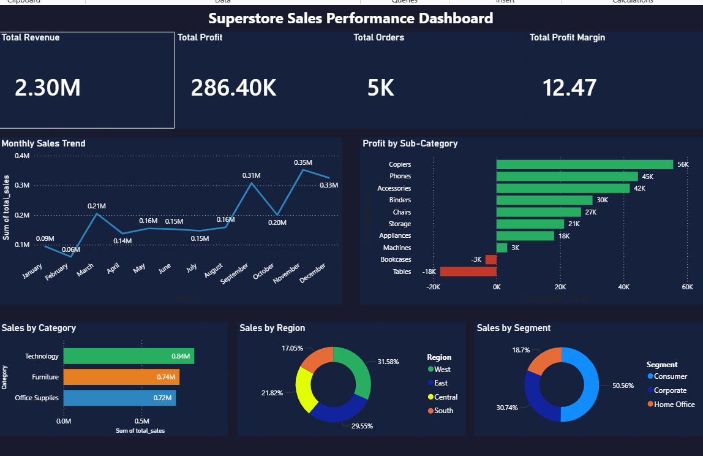

# 🛒 Superstore Sales Performance Dashboard

> Retail analytics dashboard analyzing **$2.3M in sales** across 4 years, 
> 3 product categories, and 4 US regions — built with Python, SQL, and Power BI.

---

## 📊 Dashboard Preview

---

## 🎯 Project Objective
Analyze 4 years of retail transaction data to identify top-performing 
products, underperforming categories, regional sales gaps, and 
year-over-year growth trends — delivering actionable recommendations 
for business leadership.

---

## 🔍 Key Findings

| Metric | Value |
|--------|-------|
| Total Revenue | $2.30M |
| Total Profit | $286K |
| Profit Margin | 12.47% |
| Total Orders | 5,009 |
| Total Customers | 793 |
| Date Range | 2014 – 2017 |

### 📦 By Category
| Category | Revenue | Profit Margin |
|----------|---------|---------------|
| Technology | $836K | 17.4% ✅ |
| Furniture | $742K | 2.49% ⚠️ |
| Office Supplies | $719K | 17.04% ✅ |

### 🗺️ By Region
| Region | Revenue | Profit Margin |
|--------|---------|---------------|
| West | $725K | 14.94% ✅ |
| East | $679K | 13.48% ✅ |
| Central | $501K | 7.92% ⚠️ |
| South | $392K | 11.93% |

### 🏆 Most Profitable Sub-Categories
| Sub-Category | Profit | Margin |
|---|---|---|
| Copiers | $56K | 37.2% 🏆 |
| Phones | $45K | 13.5% |
| Accessories | $42K | 25.1% |

### ⚠️ Loss-Making Sub-Categories
| Sub-Category | Loss | Margin |
|---|---|---|
| Tables | -$18K | -8.56% |
| Bookcases | -$3K | -3.02% |

---

## 💡 Business Recommendations
1. **Discontinue or reprice Tables** — losing $18K on $207K in sales
2. **Prioritize Copiers and Accessories** — highest profit margins
3. **Investigate Central region** — lowest margin at 7.92%
4. **Double down on Technology** — best margin + highest revenue

---

## 📂 Dataset
- **Source:** Kaggle Superstore Dataset
- **Records:** 9,994 orders
- **Period:** January 2014 – December 2017
- **Features:** 21 columns including Sales, Profit, Category, Region, Segment
